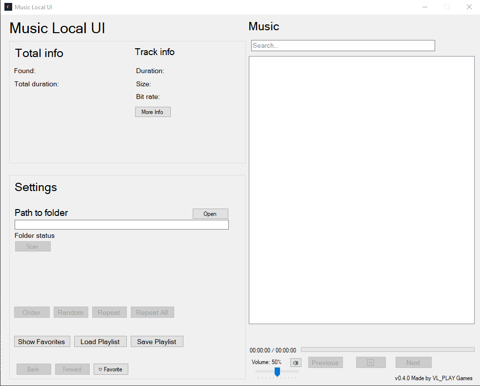

# Music Local UI

- [Read in Russian](README.ru.md)
- [Read in Japanese](README.ja.md)

A lightweight Windows music player for local audio files with advanced features and intuitive interface.

## Features

- **Compact Size**: Only ~1MB total
- **Format Support**: MP3, WAV, FLAC, AAC, OGG, WMA, M4A
- **Advanced Playback Controls**:
  - Play/Pause/Next/Previous
  - Progress bar with click-to-seek
  - Volume control with mute
  - Playback history navigation
- **Multiple Playback Modes**:
  - Order (sequential)
  - Random (shuffle)
  - Repeat (single track)
  - Repeat All (entire list)
- **Smart Library Management**:
  - Folder scanning with progress tracking
  - Real-time search with highlighting
  - Favorites system with persistent storage
  - Playlist save/load (M3U format)
- **Rich Track Information**:
  - Duration display (hh:mm:ss)
  - Bitrate and file size
  - Complete metadata (artist, album, genre, year)
  - Album art display
  - File creation date
- **User Experience**:
  - Drag & drop support for files and folders
  - Keyboard shortcuts for all major functions
  - Visual favorites indicators
  - Custom list box rendering
  - Persistent settings

## System Requirements

- **OS**: Windows 7 or later
- **.NET Framework**: 4.7.2 or later
- **Disk Space**: Less than 2MB
- **RAM**: Minimum 512MB

## Installation

1. Download the latest release from GitHub
2. Extract the ZIP file to your preferred location
3. Run `MusicLocalUI.exe`

### Required Files:
- `MusicLocalUI.exe` (Main application)
- `TagLibSharp.dll` (Metadata library)

## How to Use

### Basic Playback:
1. Click "Open" to select your music folder
2. Click "Scan" to load all audio tracks
3. Double-click any track to start playing
4. Use playback controls: ⏸ ▶ ⏭ ⏮

### Advanced Features:
- **Search**: Type in search box to filter tracks in real-time
- **Favorites**: Click "♡ Favorite" to mark favorite tracks
- **Playlists**: Use "Save Playlist"/"Load Playlist" for session management
- **History**: Use Back/Forward buttons to navigate playback history
- **View Modes**: Toggle between "Show All" and "Show Favorites"

### Keyboard Shortcuts:
- `Space` - Play/Pause
- `Ctrl+Right` - Next track
- `Ctrl+Left` - Previous track
- `Shift+Right` - Seek forward 10 seconds
- `Shift+Left` - Seek backward 10 seconds
- `F5` - Rescan folder
- `Ctrl+F` - Focus search box
- `Ctrl+M` - Toggle mute
- `Ctrl+L` - Load playlist
- `Ctrl+S` - Save playlist
- `Esc` - Clear search

### Drag & Drop:
- Drop folders to set music directory
- Drop audio files to add them directly to the library

## Playback Modes

- **Order**: Play tracks in sequential order
- **Random**: Play tracks in random order
- **Repeat**: Repeat current track indefinitely
- **Repeat All**: Repeat entire playlist

## Technical Details

- **Audio Engine**: Windows Media Player COM component
- **Metadata**: TagLib for audio file information extraction
- **UI Framework**: Windows Forms (.NET)
- **Settings**: INI-based configuration file
- **Performance**: Async file scanning for large libraries

## Troubleshooting

### Common Issues:

1. **Application won't start**:
   - Install [.NET Framework 4.7.2](https://dotnet.microsoft.com/download/dotnet-framework/net472)
   - Ensure all DLL files are in the same directory

2. **No sound**:
   - Check system volume
   - Verify audio file integrity
   - Check mute button in application

3. **Files not loading**:
   - Verify folder permissions
   - Check supported file formats
   - Ensure files are not corrupted

4. **Metadata not displaying**:
   - Some files may not contain embedded metadata
   - Application will display filename as fallback

### Support:
For issues and feature requests, please create an issue on the GitHub repository.

## License

This project is licensed under the MIT License - see the [LICENSE](LICENSE) file for details.

---

**Author**: VL_PLAY Games  

> ⚠️ **Note**: This application is designed for local audio files and does not support streaming services or online content.